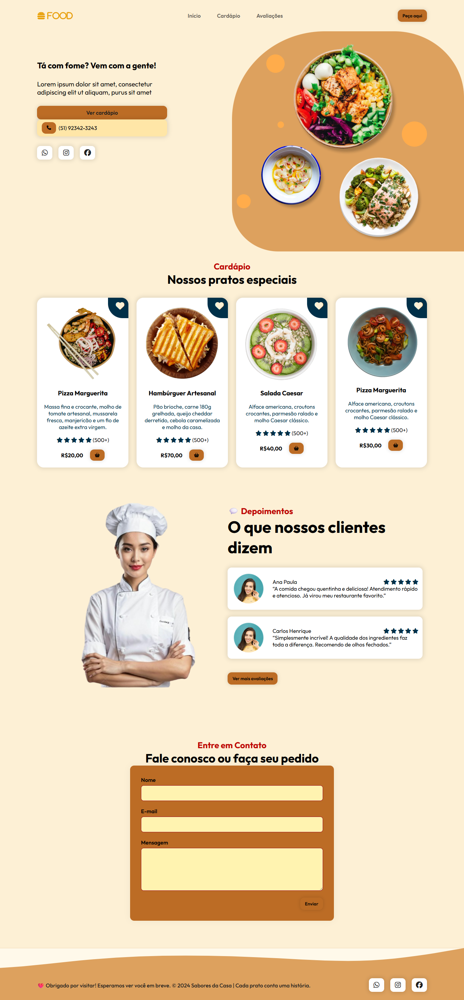

# 🍔 Landing Page - Restaurante Responsivo

Uma landing page responsiva com tema de restaurante, construída com **HTML**, **CSS** e **JavaScript**.  
Este projeto conta com um design limpo, moderno e animações suaves para melhorar a experiência do usuário.

---

## 🖼️ Prévia do Projeto

>

---

## 🌐 Visualizar Online

[🔗 Ver Projeto Online](https://seulink.com)  

---

## 🛠️ Tecnologias Utilizadas

- **HTML5** — Marcação semântica da estrutura da página  
- **CSS3** — Estilização customizada com responsividade  
- **JavaScript (puro)** — Funcionalidades interativas  
- **jQuery** — Manipulação de DOM e eventos  
- **ScrollReveal** — Animações ao rolar a página  
- **Font Awesome** — Ícones para navegação e ações  
- **Google Fonts** — Tipografia moderna e elegante  

## 🛠️ Tecnologias Utilizadas

---

## 🧪 Créditos

Este projeto foi desenvolvido a partir do canal da
Larissa Kich.
